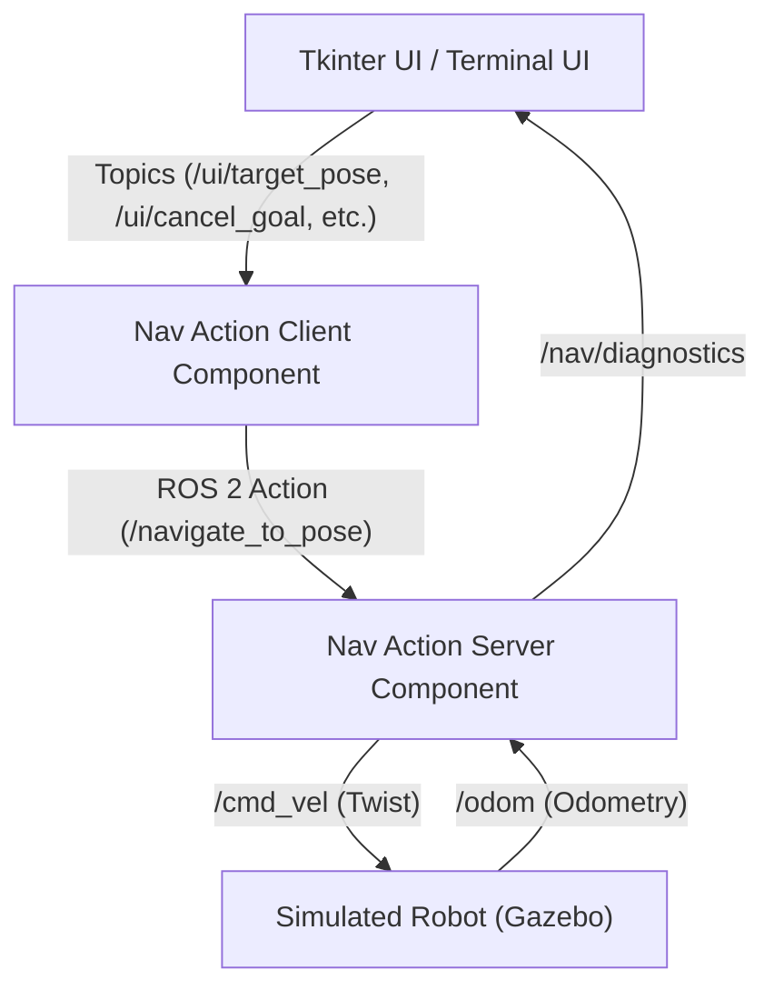

# Goal-Based Navigation Project

This project implements a **goal-based navigation system** that enables a differential drive robot to navigate to a specified pose in an empty world. It features a complete stack including simulation, custom action and message interfaces, C++ navigation controllers, and a Python Tkinter-based graphical user interface (GUI) with real-time diagnostic reporting.
A user can send a target pose **(x, y, theta)**, monitor the navigation process through the graphical interface, and cancel the goal if needed.

## System Architecture

The project is modularly structured into multiple ROS2 packages, separating the simulation, custom interfaces, navigation controllers, and user interface:



### 1. `bme_gazebo_sensors` (Simulation)
Contains the Gazebo Classic simulation environment, robot descriptions (URDF), and world files. It simulates the differential drive robot, publishes odometry (`/odom`), and subscribes to velocity commands (`/cmd_vel`).

### 2. `nav_interfaces` (Custom Interfaces)
Defines the custom ROS 2 definitions used for navigation and telemetry:
- **`NavigateToPose.action`**: 
  - **Goal**: Target `x`, `y`, and `theta`.
  - **Result**: Success boolean, final pose, and a status message.
  - **Feedback**: Current pose, distance error, heading error, and current navigation phase.
- **`NavDiagnostics.msg`**: A detailed diagnostic message used to stream high-level status and control data directly to the GUI. Includes fields for current and target poses, calculated errors (distance, heading), issued velocity commands (V, Omega), the current phase, controller mode, and goal activity status.

### 3. `nav_system` (Core Navigation Logic)

- **NavActionServerComponent**: The main controller component that implements the navigation logic. It subscribes to `/odom` and publishes to `/cmd_vel` and `/nav/diagnostics`. It implements two distinct control strategies driven by the `controller_mode` launch argument:
  - **`staged`**: The robot executes navigation sequentially: it first rotates to align with the goal heading, then moves in a straight line to the final `(x, y)` position, and finally rotates to match the final `theta`.
  - **`simultaneous`**: A continuous control law that dynamically adjusts linear and angular velocities to reach the target pose in a continuous, unified motion.
- **NavActionClientComponent**: Acts as a bridge between the GUI and the Action Server. It translates simple goal topics from the UI into Action Goals and relays feedback/results.

### 4. `nav_ui` (Graphical User Interface)
A Python-based Tkinter application that provides a user-friendly way to monitor and interact with the navigation system. 
- **Control Panel**: Allows the user to input target coordinates (`X`, `Y`, `Theta`) and send or cancel goals.
- **Diagnostic Panel**: Displays comprehensive, real-time diagnostic data updated at 10Hz, including live commands, distance/heading errors, and current controller mode.
- **Event Log**: A clear, textual readout of events such as goal acceptance, cancellation, and task completion.

## Features

- **Diagnostics Pipeline**: The Action Server streams live data (pose errors, calculated V/Omega limits, control phases) via the `/nav/diagnostics` topic.
- **GUI**: The UI includes a "Diagnostic Panel" that seamlessly captures and visually formats the diagnostic stream, ensuring capitalized standard variable representation (X, Y, Theta, Distance Error, Heading Error, Linear Velocity, Angular Velocity).
- **Launch Configuration**: The system relies on the launch file (`nav_system.launch.py`) to dictate the active `controller_mode` which can be set to `staged` or `simultaneous`.

## Topics and Communication

- **`/cmd_vel`** (`geometry_msgs/Twist`): Velocity commands sent to the robot.
- **`/odom`** (`nav_msgs/Odometry`): Odometry data received from the robot.
- **`/navigate_to_pose`** (`nav_interfaces/action/NavigateToPose`): Action server communication.
- **`/nav/diagnostics`** (`nav_interfaces/msg/NavDiagnostics`): Real-time high-level telemetry and status reporting.
- **`/ui/target_pose`** (`geometry_msgs/Pose2D`): UI sending a new goal to the client component.
- **`/ui/cancel_goal`** (`std_msgs/Empty`): UI requesting to cancel the current goal.
- **`/ui/nav_status`** (`std_msgs/String`): Client component sending status updates/feedback to the UI.
- **`/ui/nav_result`** (`std_msgs/String`): Client component sending the final result to the UI.

## How to Run

### Complete System Launch

System can be run with all components (Gazebo simulation, action server, action client, and Tkinter UI) using the provided launch file after building and sourcing the workspace. 

```bash
# Source ROS 2 and your workspace
source /opt/ros/jazzy/setup.bash
source install/setup.bash

# Run the launch file (defaults to staged mode)
ros2 launch nav_system nav_system.launch.py

# To explicitly launch in simultaneous/staged mode, append the argument:
ros2 launch nav_system nav_system.launch.py controller_mode:=<simultaneous|staged>
```

## Dependencies

- ROS 2 Jazzy
- Gazebo Classic
- Python 3
- Tkinter GUI framework
